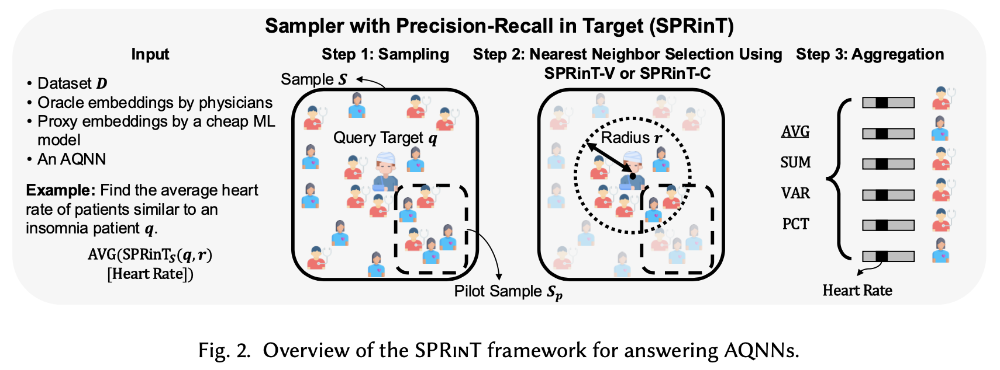
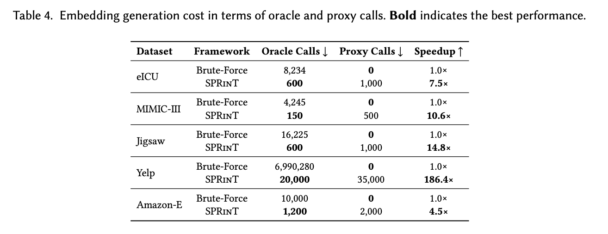
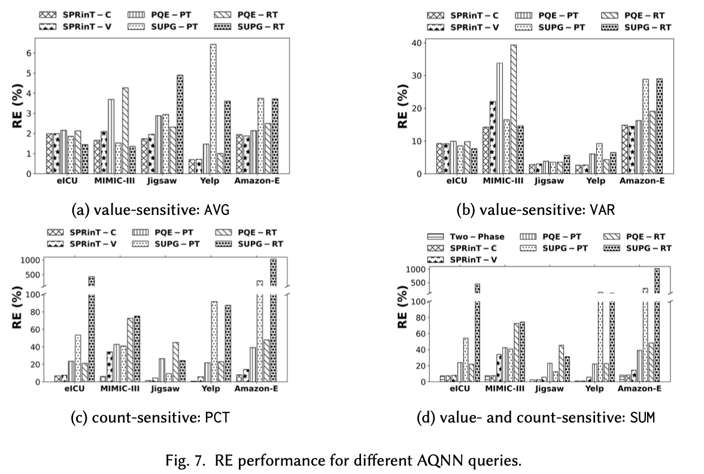

<!-- MathJax -->

  <h1>On Efficient Approximate Aggregate Nearest Neighbor Queries over Learned Representations</h1>
  
<strong>Carrie Wang, Sihem Amer-Yahia, Laks Lakshmanan, Reynold Cheng</strong>

  
<strong><a href="#">[Paper]</a></strong> &nbsp;&nbsp; <strong><a href="https://github.com/Carrieww/AQNNs">[Code]</a></strong>

  

<h2>Abstract</h2>

We study <strong>Aggregation Queries over Nearest Neighbors (AQNN)</strong>, which compute aggregates over the learned representations of the neighborhood of a designated query object. For example, a medical professional may be interested in <em>the average heart rate of patients whose representations are similar to that of an insomnia patient</em>. Answering AQNNs accurately and efficiently is challenging due to the high cost of generating high-quality representations (e.g., via a deep learning model trained on human expert annotations) and the different sensitivities of different aggregation functions to neighbor selection errors. We address these challenges by combining high-quality and low-cost representations to approximate the aggregate. We characterize <strong>value- and count-sensitive AQNNs</strong> and propose the <strong><em>Sampler with Precision-Recall in Target</em> (SPRinT)</strong>, a query answering framework that works in three steps: (1) sampling, (2) nearest neighbor selection, and (3) aggregation. We further establish <strong>theoretical bounds on sample sizes and aggregation errors</strong>. Extensive experiments on five datasets from three domains (medical, social media, and e-commerce) demonstrate that <strong>SPRinT achieves the lowest aggregation error with minimal computation cost</strong> in most cases compared to existing solutions. SPRinT's performance remains stable as dataset size grows, confirming its <strong>scalability</strong> for large-scale applications requiring both accuracy and efficiency.

<h2>Key Features</h2>

<ul>
  <li><strong>Efficient Query Processing over Imperfect Data Representations</strong>: Uses proxy embeddings for fast filtering and oracle embeddings for accurate verification</li>
  <li><strong>Wide Range of Aggregation Functions</strong>: Supports average, variance, sum, proportion, and more</li>
  <li><strong>Probabilistic Guarantees</strong>: Provides theoretical upper bounds for approximation errors</li>
  <li><strong>Scalable</strong>: Handles large-scale datasets efficiently with minimal oracle calls</li>
</ul>

<h2>Experimental Results</h2>

Our comprehensive experiments on medical (eICU, MIMIC-III), e-commerce (Yelp, Electronics), and social media (Jigsaw) datasets demonstrate the effectiveness of our approach:

<h3>Embedding Generation Cost</h3>

  

SPRinT achieves 4.5–186.4× speedup by using proxy models for a small fraction of objects to avoid the majority of expensive oracle calls. For instance, on Jigsaw, SPRinT uses proxy models for ~6% of objects to avoid >96% of oracle calls (assuming oracle calls are 2× slower than proxy calls, which is conservative compared to the 2–10× gaps reported in prior work).

<h3>Relative Error Performance</h3>

  

SPRinT-C consistently achieves the lowest relative error (RE) across all datasets. The Two-Phase strategy (combining SPRinT-V and SPRinT-C) also consistently achieves the lowest RE across all datasets, while SPRinT-V performs best on AVG and VAR aggregations for Amazon-E.

<h2>Citation</h2>

<pre><code>@inproceedings{wang2026efficient,
  title={On Efficient Approximate Aggregate Nearest Neighbor Queries over Learned Representations},
  author={Wang, Carrie and Amer-Yahia, Sihem and Lakshmanan, Laks and Cheng, Reynold},
  booktitle={ACM SIGMOD 2026},
  year={2026}
}
</code></pre>

